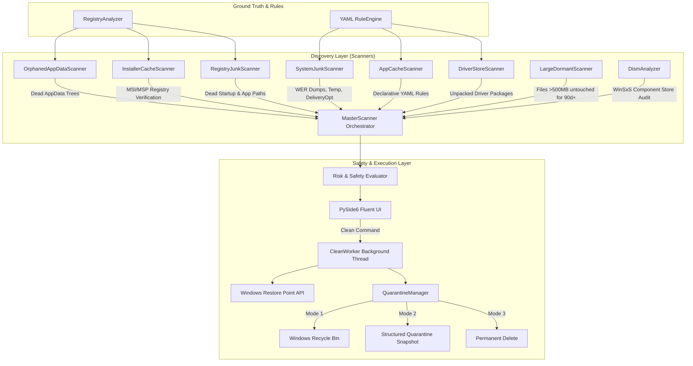

# 📖 AetherClean — Technical Architecture & Deep-Dive Reference

## 1. Overview & Core Philosophy

**AetherClean** is engineered as a modern, safe, and intelligent alternative to classical "blind" cleanup utilities (CCleaner, BleachBit). Rather than executing static deletions against hardcoded paths, AetherClean builds a dynamic model of your system by cross-referencing live filesystem structures against the Windows Registry, Windows Store package repositories, and file activity heuristics.



---

## 2. Specialized Scanners & Algorithms

### 2.1. Registry Ground-Truth Analyzer (`core/registry_analyzer.py`)
- **Data Sources**:
  1. `HKLM\SOFTWARE\Microsoft\Windows\CurrentVersion\Uninstall` (64-bit `KEY_WOW64_64KEY`)
  2. `HKLM\SOFTWARE\Microsoft\Windows\CurrentVersion\Uninstall` (32-bit `KEY_WOW64_32KEY`)
  3. `HKCU\SOFTWARE\Microsoft\Windows\CurrentVersion\Uninstall`
  4. UWP / AppX Packages: `HKCU\Software\Classes\Local Settings\Software\Microsoft\Windows\CurrentVersion\AppModel\Repository\Packages`
  5. Windows Installer Database: `HKLM\SOFTWARE\Microsoft\Windows\CurrentVersion\Installer\UserData\S-1-5-18\Products` and `Patches`.
- **Tokenization & Search Index**:
  - Application display names and publishers are tokenized and indexed into N-gram token sets.
  - This allows fuzzy matching of complex directory trees (e.g. `Adobe\Premiere Pro 2024`, `Telegram Desktop`, `EpicGamesLauncher`).
- **Hard Whitelist**:
  - Critical system vendors and services (`Microsoft`, `Windows`, `Intel`, `NVIDIA`, `AMD`, `Realtek`, `Windows Defender`, etc.) are protected against false positives.

### 2.2. Orphaned AppData Scanner (`scanners/orphaned_appdata_scanner.py`)
- Traverses `%LOCALAPPDATA%`, `%APPDATA%`, and `%PROGRAMDATA%`.
- For each directory:
  1. Checks whitelist exclusion.
  2. Matches against active registered software.
  3. Inspects file modification times (`mtime`).
  4. If an application was uninstalled and its folder has remained untouched for >30–90 days, it is flagged as `ORPHANED_APPDATA` with risk rating `MEDIUM`.

### 2.3. Windows Installer Cache Validator (`scanners/installer_scanner.py`)
- The `C:\Windows\Installer` directory stores cached `.msi` and `.msp` installation and patch packages.
- Over time, accumulated updates leave unreferenced patches orphaned on disk, consuming 10–50 GB.
- **Algorithm**:
  - Enumerates all active `LocalPackage` values from Windows Installer registry branches.
  - Compares every `.msi` and `.msp` file in `C:\Windows\Installer` against this registered set.
  - Unregistered files are safely flagged for quarantine.

### 2.4. Windows Registry Debris Scanner (`scanners/registry_junk_scanner.py`)
- **Path Validation**:
  - Extracts binary and `.dll` paths from `HKCU\...\Run`, `HKLM\...\Run`, `RunOnce`, and `App Paths`.
  - Verifies physical presence on disk. Dead references pointing to non-existent binaries are flagged as `SAFE` to clean.
- **Orphaned Software Keys**:
  - Analyzes `HKCU\Software\<Vendor>` keys for deleted software with zero matching filesystem traces.

### 2.5. Large Dormant Files Finder (`scanners/large_dormant_scanner.py`)
- Audits user directories (`Downloads`, `Videos`, `Documents`, `Desktop`).
- Identifies large files ($\ge 500$ MB) untouched for $\ge 90$ days.
- Prioritizes extensions: `.iso`, `.img`, `.vmdk`, `.vhdx`, `.zip`, `.rar`, `.7z`, `.exe`, `.msi`.
- Always classified as `HIGH RISK` and **never auto-selected**, ensuring the user retains explicit control.

---

## 3. Safety Model & 1-Click Quarantine Subsystem

### 3.1. Why Quarantine?
Standard Windows Recycle Bin (`$Recycle.Bin`):
- Loses relative directory structures when restoring complex deeply nested folders.
- Automatically purges old files when storage quota is reached.
- Lacks session tracking.

**AetherClean Quarantine Snapshot**:
- Creates an isolated session folder: `C:\AetherClean_Quarantine\session_YYYYMMDD_HHMMSS\`.
- Writes a structured `manifest.json`:
  ```json
  {
    "session_id": "session_20260826_001530",
    "timestamp": "2026-08-26T17:15:30",
    "total_bytes": 1548291040,
    "is_restored": false,
    "records": [
      {
        "original_path": "C:\\Users\\User\\AppData\\Local\\OldAbandonedApp",
        "quarantine_path": "C:\\AetherClean_Quarantine\\session_...\\item_1_OldAbandonedApp",
        "is_dir": true,
        "size": 1548291040,
        "category": "orphaned_appdata"
      }
    ]
  }
  ```
- **1-Click Rollback**: Clicking "Restore" reconstructs the exact original directory tree and moves files back seamlessly.

### 3.2. Windows System Restore Integration (`core/restore_point.py`)
Automatically invokes PowerShell `Checkpoint-Computer` before deep cleaning operations if enabled in settings.

---

## 4. Declarative YAML Rules

Rules are located in `config/rules/*.yaml`.

```yaml
- id: "unique_rule_id"
  name: "Human Readable Rule Name"
  category: "app_cache" # app_cache | system_junk | drivers | installer_cache
  risk_level: "safe"    # safe | medium | high
  safety_label: "Safe: brief advice to the user"
  description: "Detailed description of what these files are."
  paths:
    - "%LOCALAPPDATA%\\Vendor\\App\\Cache"
    - "%APPDATA%\\Vendor\\App\\GPUCache"
    - "%TEMP%\\AppTemp_*"
  options:
    delete_contents_only: true # Delete contents without deleting the root folder
    min_age_hours: 12          # Ignore files newer than N hours
```

---

## 5. Python API Usage

AetherClean's core engine can be integrated programmatically into scripts or CI pipelines:

```python
from core.scanner import MasterScanner
from core.quarantine_manager import QuarantineManager
from core.models import CleanAction, format_bytes

# 1. Initialize and run a full scan on drive C:
scanner = MasterScanner()
results = scanner.run_full_scan(target_drive="C:")

print(f"Total recoverable: {format_bytes(results.total_bytes)}")
for item in results.items:
    print(f"[{item.risk_level.value.upper()}] {item.title}: {item.format_size()}")

# 2. Safely clean items to quarantine
safe_items = [i for i in results.items if i.risk_level.value == "safe"]
qm = QuarantineManager()
freed_bytes, count, errors = qm.execute_cleaning(
    items_to_clean=safe_items,
    action=CleanAction.QUARANTINE
)
print(f"Quarantined {count} items, freed {format_bytes(freed_bytes)}.")
```
