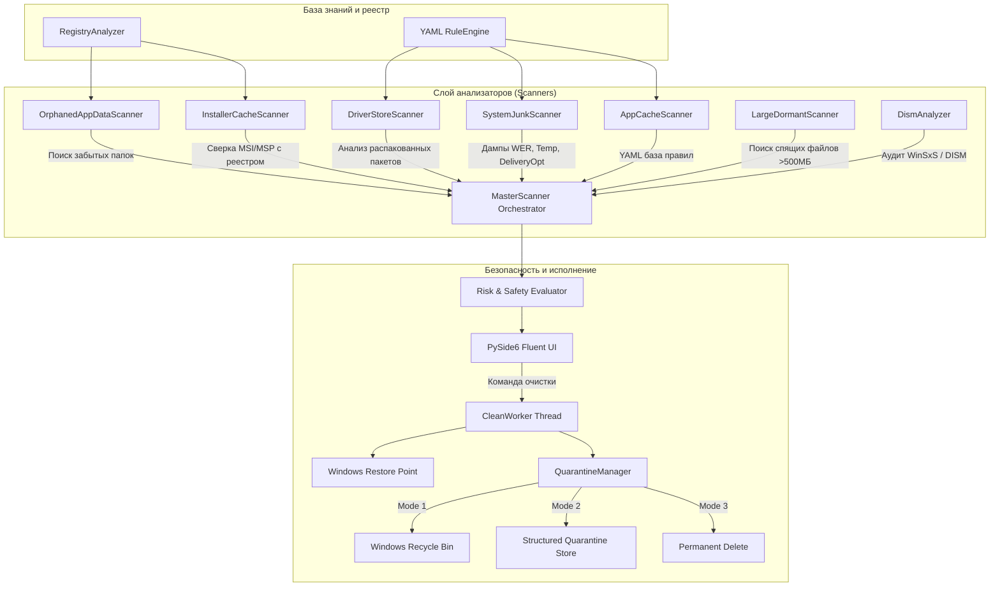

# 📖 AetherClean — Полная техническая документация

## 1. Архитектура и принципы работы

AetherClean спроектирован как интеллектуальная альтернатива классическим «слепым» утилитам очистки (CCleaner, BleachBit). Программа не просто удаляет файлы по статическому списку путей, а строит динамическую цифровую модель системы, сопоставляя состояние файловой системы с реестром Windows, базами установленных пакетов и метаданными активности файлов.



---

## 2. Модули анализа и алгоритмы

### 2.1. Анализатор реестра и установленного ПО (`core/registry_analyzer.py`)
- **Источники данных**:
  1. `HKLM\SOFTWARE\Microsoft\Windows\CurrentVersion\Uninstall` (64-бит `KEY_WOW64_64KEY`)
  2. `HKLM\SOFTWARE\Microsoft\Windows\CurrentVersion\Uninstall` (32-бит `KEY_WOW64_32KEY`)
  3. `HKCU\SOFTWARE\Microsoft\Windows\CurrentVersion\Uninstall`
  4. UWP / AppX Packages: `HKCU\Software\Classes\Local Settings\Software\Microsoft\Windows\CurrentVersion\AppModel\Repository\Packages`
  5. Windows Installer Database: `HKLM\SOFTWARE\Microsoft\Windows\CurrentVersion\Installer\UserData\S-1-5-18\Products` и `Patches`.
- **Токенизация и индексирование**:
  - Названия приложений (Display Name) и разработчиков (Publisher) очищаются от спецсимволов и разбиваются на поисковые токены.
  - Строится N-граммный и токенный индекс, позволяющий распознавать папки вида `Adobe\Premiere Pro 2024`, `Telegram Desktop`, `EpicGamesLauncher`.
- **Система белых списков**:
  - Встроенный жесткий список критических вендоров и системных компонентов (`Microsoft`, `Windows`, `Intel`, `NVIDIA`, `AMD`, `Realtek`, `Windows Defender` и др.), гарантирующий защиту от ложноположительных срабатываний.

### 2.2. Поиск папок-сирот (`scanners/orphaned_appdata_scanner.py`)
- Обходит директории:
  - `%LOCALAPPDATA%` (`C:\Users\<User>\AppData\Local`)
  - `%APPDATA%` (`C:\Users\<User>\AppData\Roaming`)
  - `%PROGRAMDATA%` (`C:\ProgramData`)
- Для каждой вложенной папки проверяет:
  1. Наличие в белом списке.
  2. Соответствие токенам установленных в реестре программ.
  3. Время последней модификации (`mtime`) файлов внутри папки.
  4. Если программа удалена, а файлы не изменялись более N дней (настраивается в `settings.yaml`, по умолчанию 30 дней) — папка маркируется как `ORPHANED_APPDATA` с уровнем риска `MEDIUM`.

### 2.3. Валидатор кэша установщиков (`scanners/installer_scanner.py`)
- Каталог `C:\Windows\Installer` содержит копии `.msi` и `.msp` пакетов, необходимых для изменения или удаления установленных программ.
- Со временем при обновлениях программ старые версии пакетов часто теряют привязку к реестру, превращаясь в «мертвый груз» весом 10–50 ГБ.
- **Алгоритм**:
  - Считывает точный перечень активных значений `LocalPackage` из реестра Windows Installer.
  - Файлы `.msi` / `.msp` на диске, не входящие в белый список реестра, определяются как осиротевшие.
  - Рекомендуемое действие — помещение в **Карантин**.

### 2.4. Поиск тяжелых спящих файлов (`scanners/large_dormant_scanner.py`)
- Сканирует пользовательские каталоги `Downloads`, `Videos`, `Documents`, `Desktop`.
- Фильтрует файлы по порогу размера (например, $\ge 500$ МБ) и дате последнего изменения/обращения ($\ge 90$ дней).
- Особое внимание уделяется расширениям: `.iso`, `.img`, `.vmdk`, `.vhdx`, `.zip`, `.rar`, `.7z`, `.exe`, `.msi`.
- Всегда маркируется как `HIGH` риск и **никогда не выбирается по умолчанию**, защищая ценные файлы пользователя.

---

## 3. Модель безопасности и подсистема Карантина

### 3.1. Зачем нужен Карантин?
Обычная Корзина Windows (`$Recycle.Bin`):
- Имеет общий лимит размера (при переполнении старые файлы удаляются без предупреждения).
- Сваливает все файлы в общую кучу без фиксации сессий и связанных групп.
- Ручной возврат сотен мелких файлов из разных подкаталогов `AppData` крайне трудоемок.

**Карантин AetherClean**:
- Создает изолированную сессию `C:\AetherClean_Quarantine\session_YYYYMMDD_HHMMSS\`.
- Формирует структурированный файл `manifest.json`:
  ```json
  {
    "session_id": "session_20260826_001530",
    "timestamp": "2026-08-26T00:15:30",
    "total_bytes": 1548291040,
    "is_restored": false,
    "records": [
      {
        "original_path": "C:\\Users\\User\\AppData\\Local\\OldAbandonedApp",
        "quarantine_path": "C:\\AetherClean_Quarantine\\session_...\\item_1_OldAbandonedApp",
        "is_dir": true,
        "size": 1548291040,
        "category": "orphaned_appdata"
      }
    ]
  }
  ```
- **Откат в 1 клик**: при нажатии кнопки «Восстановить» в окне Карантина менеджер автоматически восстанавливает всю структуру каталогов и возвращает файлы на их исходные места.

### 3.2. Точки восстановления Windows (`core/restore_point.py`)
Перед очисткой глубоких системных компонентов или папок с риском `MEDIUM`/`HIGH` программа может автоматически инициировать создание системной контрольной точки Windows System Restore (`Checkpoint-Computer`).

---

## 4. Декларативная система правил (YAML Rules)

Правила описываются в формате YAML в каталоге `config/rules/`.

### Формат правила:
```yaml
- id: "unique_rule_id"
  name: "Понятное название правила"
  category: "app_cache" # app_cache | system_junk | drivers | installer_cache
  risk_level: "safe"    # safe | medium | high
  safety_label: "Безопасно: краткая подсказка пользователю"
  description: "Подробное описание, что это за файлы и зачем они нужны."
  paths:
    - "%LOCALAPPDATA%\\Vendor\\App\\Cache"
    - "%APPDATA%\\Vendor\\App\\GPUCache"
    - "%TEMP%\\AppTemp_*"
  options:
    delete_contents_only: true # Очищать содержимое, не удаляя саму корневую папку
    min_age_hours: 12          # Игнорировать файлы новее указанного числа часов
```

Поддерживаемые переменные окружения: `%LOCALAPPDATA%`, `%APPDATA%`, `%PROGRAMDATA%`, `%TEMP%`, `%WINDIR%`, `%SystemDrive%`, `%USERPROFILE%`.

---

## 5. Использование через Python API

Вы можете использовать ядро AetherClean программно в своих скриптах:

```python
from core.scanner import MasterScanner
from core.quarantine_manager import QuarantineManager
from core.models import CleanAction, format_bytes

# 1. Сканирование диска C:
scanner = MasterScanner()
results = scanner.run_full_scan(target_drive="C:")

print(f"Всего найдено: {format_bytes(results.total_bytes)}")
for item in results.items:
    print(f"[{item.risk_level.value.upper()}] {item.title}: {item.format_size()}")

# 2. Очистка только безопасных элементов в Карантин
safe_items = [i for i in results.items if i.risk_level.value == "safe"]
qm = QuarantineManager()
freed_bytes, count, errors = qm.execute_cleaning(
    items_to_clean=safe_items,
    action=CleanAction.QUARANTINE
)
print(f"Освобождено в карантин: {format_bytes(freed_bytes)}")
```
